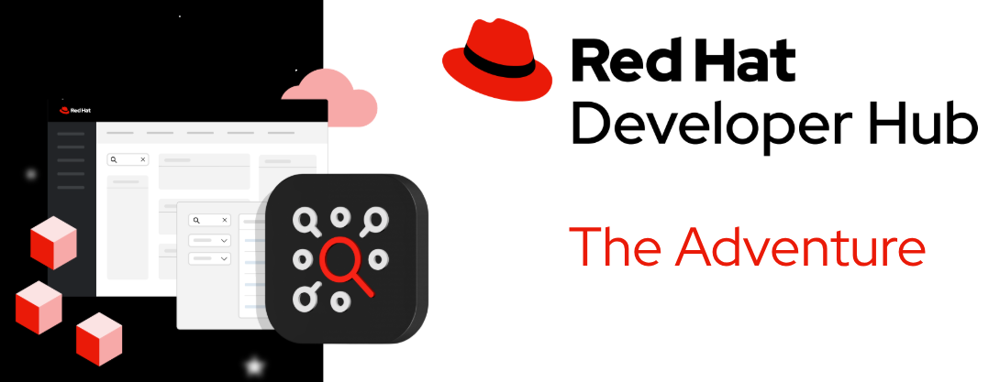
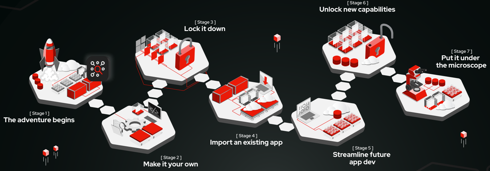

## Hi there 👋!!!

<!--

**Here are some ideas to get you started:**

🙋‍♀️ A short introduction - what is your organization all about?
🌈 Contribution guidelines - how can the community get involved?
👩‍💻 Useful resources - where can the community find your docs? Is there anything else the community should know?
🍿 Fun facts - what does your team eat for breakfast?
🧙 Remember, you can do mighty things with the power of [Markdown](https://docs.github.com/github/writing-on-github/getting-started-with-writing-and-formatting-on-github/basic-writing-and-formatting-syntax)
-->

## 🌟 Mission

This is an adventure to introduce your teams in features and capabilities
of Red Hat Developer Hub improving Developer Experience and Developer Productivity.

## A DevEx adventure from Zero to Hero

Your team, as platform engineers, is looking to improve the daily basis of many different
development teams and create the best developer experience (DevEx) for them.
Red Hat Developer Hub is key in that journey providing different features and integration
capabilities with multiple tools. However, your team is facing different challenges which
should be resolved before providing the Nirvana for Developers.

Which challenge do you want to resolve? Here starts your adventure with
Red Hat Developer Hub to become a hero, and improve the developer experience.

## The Stages of your Quest

Your journey to transform the Developer Experience (DevEx) begins with a series of
**epic stages**—each designed to guide you through Red Hat Developer Hub's incredible
capabilities while solving key challenges developers and platform engineers face daily.
The adventure progresses step-by-step, starting with the basics and evolving
into mastery. The first two stages are essential to lay the foundation of your journey,
but after that, the path is yours to choose. Every stage is an opportunity to learn,
experiment, and conquer!

